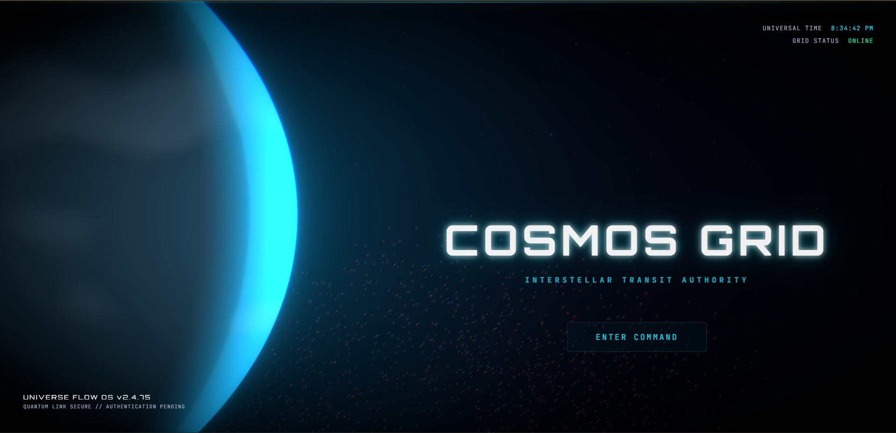
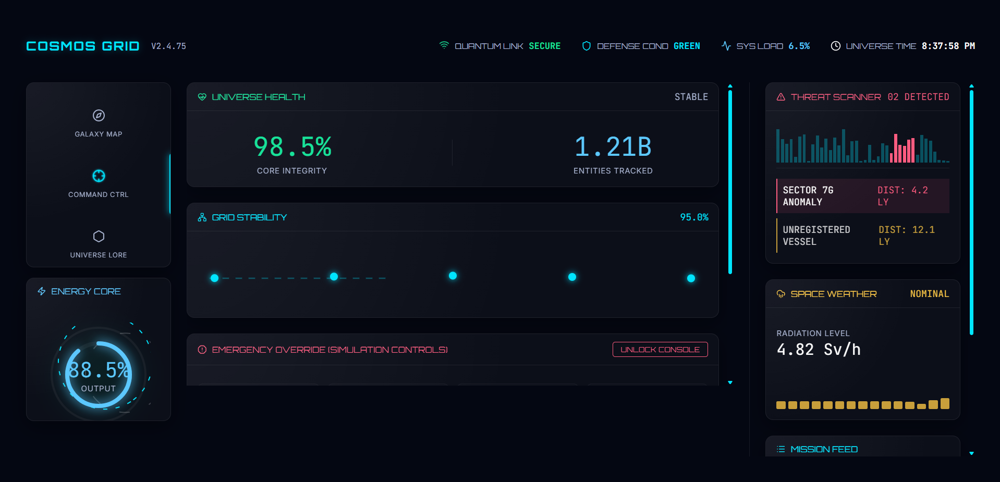
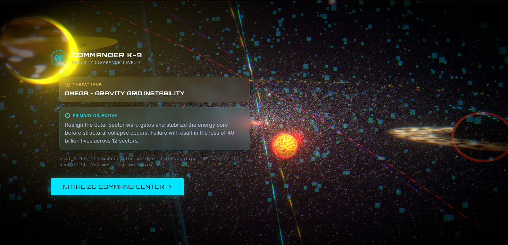
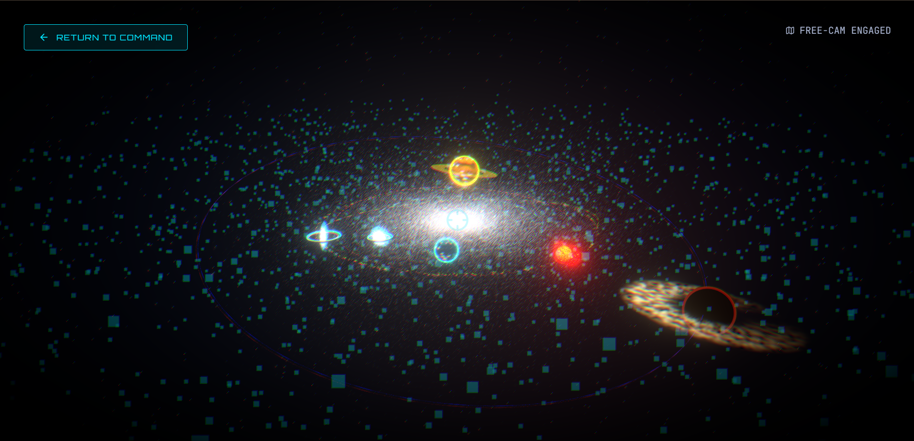
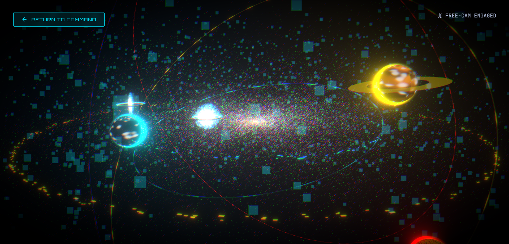
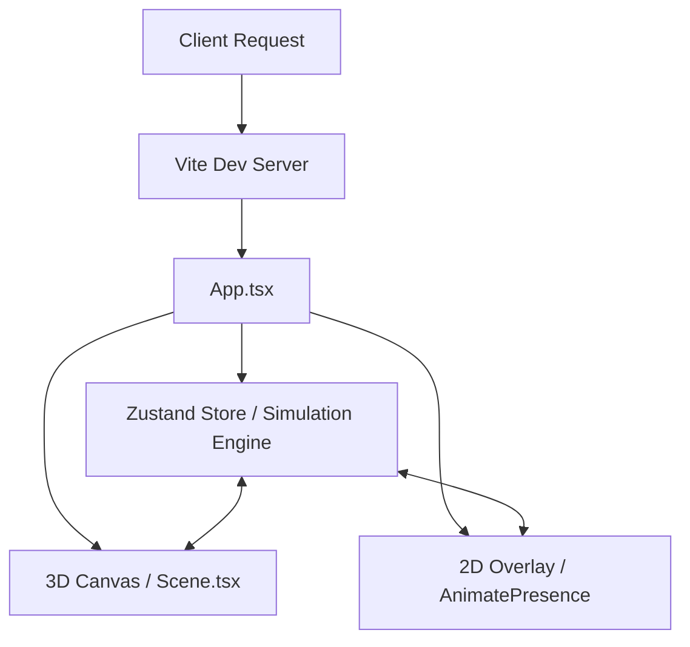
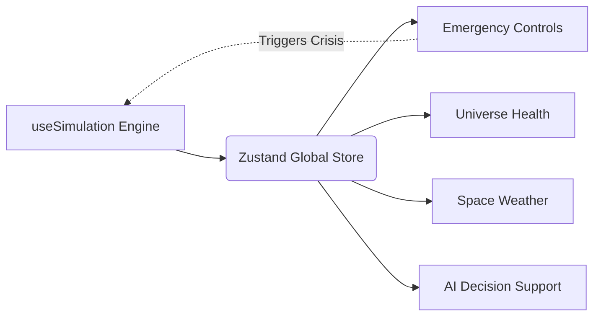

<div align="center">


<br/>

# COSMOS GRID

[](https://reactjs.org/)
[](https://threejs.org/)
[](https://vitejs.dev/)
[](https://www.typescriptlang.org/)
[](#license)

**"Nothing Moves Without Permission."**

*Interstellar Transit Authority | Universe Flow OS | Year: 2475*

<br/>

### 🚀 [PLAY LIVE DEMO](https://cosmos-grid.vercel.app/)

<br/>



</div>

---

## 🌌 Overview

**COSMOS GRID** is the classified digital interface of the Universe Flow Operating System (UF-OS). Administered by the **Interstellar Transit Authority (ITA)** in the year 2475, this system serves as the central nervous system for all intergalactic travel, gravitational lane stabilization, and deep-space threat assessment.

This project is a highly immersive, cinematic 3D web application designed to blur the line between a frontend dashboard and a premium sci-fi film experience. It utilizes a continuous client-side procedural simulation engine to create an environment that feels alive, interconnected, and reactive.

---

## 📖 Story

Long before the current era, **The Architects** forged the **Gravity Grid**—an invisible superhighway connecting distant galaxies. By stabilizing the volatile forces of dark matter, they constructed **Warp Gates** that allowed for instantaneous transit across millions of lightyears.

To maintain this delicate balance, they engineered the **Universe Flow OS**.

But the Architects have vanished. 

Now, in 2475, the Universe Flow OS is managed by the Interstellar Transit Authority. However, a mysterious corruption is spreading through the Gravity Lanes. Unexplained solar flares, unexpected black hole expansions, and lane collapses are occurring with terrifying frequency. The system is approaching **Final Gridlock**.

You have been granted Commander-level access. It is your responsibility to monitor the grid, override critical failures, and maintain the stability of the universe.

---

## ⚡ Features

| Feature | Description |
| :--- | :--- |
| 🌌 **Interactive Galaxy** | A procedural, node-based 3D visualization of the known universe and active warp lanes. |
| 🛰 **Fleet Monitoring** | Real-time tracking of interstellar spacecraft rendered via optimized `InstancedMesh`. |
| ⚡ **Universe Health** | Live metric tracking of core integrity, connected directly to a procedural simulation engine. |
|🚨 **Emergency Override** | A classified simulation console allowing Commanders to trigger and resolve galactic crisis scenarios. |
| 🧠 **AI Decision Support** | Context-aware artificial intelligence that reads global states and suggests countermeasures. |
| 🌠 **Space Weather** | Animated, reactive telemetry charting radiation levels and solar flare activity. |
| 📡 **Mission Feed** | An auto-scrolling, live operations log capturing all grid events and anomalies. |
| 🌀 **Warp Gates** | Real-time 3D shaders depicting counter-rotating portal distortions and spatial anomalies. |
| 🎥 **Cinematic Boot Sequence** | An immersive, multi-stage parallax opening sequence designed to build intense anticipation. |
| ✨ **Premium Animations** | Hardware-accelerated `framer-motion` physics, magnetic hover states, and smooth easing. |

---

## 🖼 Screenshots

<div align="center">


*Command Center UI & Real-Time Telemetry*

<br/>


*Emergency Mission Briefing Interface*

<br/>


*Interactive Galaxy Map (Wide Angle)*

<br/>


*Interactive Galaxy Map (Core View)*

</div>

---

## 🛠 Tech Stack

| Technology | Purpose |
| :--- | :--- |
| **React (v18)** | Component-based UI architecture. |
| **Vite** | Ultra-fast frontend build tooling and HMR. |
| **TypeScript** | Strict type safety and robust architecture. |
| **Three.js** | Core WebGL 3D rendering engine. |
| **React Three Fiber (R3F)** | React ecosystem wrapper for declarative Three.js. |
| **Framer Motion** | Physics-based 2D animations, springs, and layout transitions. |
| **Zustand** | Lightweight, high-performance global state management. |
| **Lucide React** | Premium, consistent iconography. |
| **React Postprocessing** | Cinematic effects (Bloom, Vignette, Chromatic Aberration). |

---

## 🏗 Architecture

### Project Flow



### State & Simulation Flow



---

## 📁 Folder Structure

```text
src/
├── assets/                 # Static images, models, and fonts
├── components/             # React Components
│   ├── 3d/                 # R3F Canvas components, shaders, and meshes
│   ├── modules/            # Major full-screen OS modules (Galaxy, Dossier)
│   ├── ui/                 # Reusable layout and interface elements
│   ├── widgets/            # Command Center dashboard widgets
│   ├── BootSequence.tsx    # Cinematic entry sequence
│   └── Dashboard.tsx       # Core Command Center layout
├── hooks/                  # Custom React hooks (e.g., useSimulation)
├── store/                  # Zustand state management and types
├── App.tsx                 # Root component and module routing
├── index.css               # Global glassmorphism design tokens
└── main.tsx                # React DOM entry point
```

---

## 🚀 Installation

Ensure you have Node.js (v18+) installed.

```bash
# Clone the repository
git clone https://github.com/yourusername/cosmos-grid.git

# Navigate to directory
cd cosmos-grid

# Install dependencies
npm install

# Start the development server
npm run dev

# Build for production
npm run build
```

---

## 🏎 Performance Optimization

- **GPU Acceleration**: All heavy 2D animations utilize `framer-motion` to leverage GPU-accelerated transforms and opacity changes.
- **InstancedMesh**: The `SpacecraftFleet` renders hundreds of individual ships in a single draw call.
- **Shader Optimization**: Complex visual effects (Black Holes, Warp Gates, Planetary Atmospheres) are computed natively on the GPU using custom GLSL shaders rather than stacking costly post-processing passes.
- **Dual-Layer Parallax**: Depth effects are calculated efficiently using normalized mouse coordinates mapped to `useSpring` and injected into the Three.js render loop.

---

## 🎨 Design Philosophy

> "Less is more. Every visual element must have purpose."

Inspired by **Apple Vision Pro**, **Interstellar**, and **NASA visualization systems**, COSMOS GRID adheres to a strict design philosophy:
- **Minimalism & Negative Space**: UI elements exist to serve the atmosphere, not crowd it.
- **Micro-Interactions**: Hover states pull magnetically, borders pulse with energy, and numbers count up using physical spring dynamics.
- **Consistency**: A unified palette of Deep Space Black, Cyan, and Danger Red.
- **Immersion Over Interface**: The HUD feels like an environmental projection rather than a website DOM.

---

## 🔮 Future Scope

- [ ] **Multiplayer Instance Synchronization**: Allow multiple Commanders to resolve crises concurrently via WebSockets.
- [ ] **AI Voice Commander**: Integrate Web Speech API and LLMs for vocal crisis response.
- [ ] **Procedural Galaxy Generation**: Compute entirely unique star systems and planets on the fly based on seeded noise.
- [ ] **WebGPU Port**: Migrate heavy shaders to WebGPU for extreme performance gains on complex particle systems.

---

## 👥 Team

<div align="left">

| Contributor | Role | Links |
| :--- | :--- | :--- |
| **Suraj Sawant** | Full Stack / 3D Engineer | [GitHub](https://github.com/daystar-1nine) • [LinkedIn](https://www.linkedin.com/in/surajsawant19062005/) |
| **Yatharth Raut** | Frontend / UI Developer | [GitHub](https://github.com/YAth-f4) • [LinkedIn](https://www.linkedin.com/in/yatharth-raut-552901420/) |
| **Shrawani Kadu** | UI/UX Designer | [GitHub](https://github.com/shrawani3007) • [LinkedIn](https://www.linkedin.com/in/shrawani-kudu-212767393/) |
| **Diya Singh** | Frontend / Quality Assurance | [GitHub](https://github.com/diya-1720) • [LinkedIn](https://www.linkedin.com/in/diya-singh-897a52351/) |

</div>

---

## 📄 License

This project is licensed under the [MIT License](LICENSE).

---

## 🙏 Acknowledgements

- The incredible open-source communities behind [Three.js](https://threejs.org/) and [React Three Fiber](https://docs.pmnd.rs/react-three-fiber).
- [Framer Motion](https://www.framer.com/motion/) for enabling buttery-smooth physics animations.
- The Awwwards community for continuous design inspiration.
